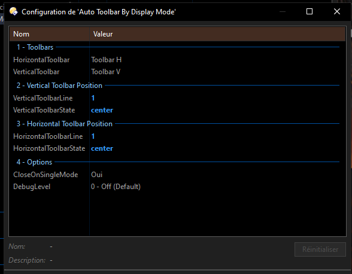

❄️ Auto Toolbar By Display Mode ❄️

📖 Overview
Auto Toolbar By Display Mode is a Directory Opus script that automatically shows or hides toolbars depending on the current lister display mode.  
It was designed to streamline workflows by dynamically toggling between two toolbars—one for Dual Vertical mode and one for Dual Horizontal mode—without requiring the user to restart or re‑enter folders.

This script is based on AutoFolderCommand.vbs by ThioJoe 🌿 https://resource.dopus.com/t/script-for-running-various-commands-when-entering-specific-paths/51839 🌿, but i keep only the toolbar feature with some enhancement for my own workflow:
- Detect changes between dual vertical and dual horizontal layouts in real time.
- Remember toolbar positions and restore them correctly.
- Provide flexible configuration options for toolbar placement and behavior.

---

✨ Features
- 🔄 Automatic Toolbar Switching  
  - Shows Toolbar V when in Dual Vertical mode.  
  - Shows Toolbar H when in Dual Horizontal mode.  
  - Closes toolbars when switching back to Single Display mode (optional).
  
- ⚡ Instant Toggle  
  - Toolbars update immediately when switching between vertical and horizontal layouts.  
  - No need to quit or re‑enter the folder to trigger changes.

- 🧩 Position Memory  
  - Toolbar positions (state and line) are remembered and restored.  
  - Supports placement at top, bottom, left, right, center, or float.

- 🛠️ Configurable Options  
  - Choose toolbar names for vertical and horizontal modes.  
  - Set toolbar position and line index.  
  - Enable/disable closing toolbars in single mode.  
  - Adjustable debug logging levels (Info, Verbose, Debug).

---

⚙️ Configuration
The script exposes several configuration settings in Script Add‑ins:

| Setting | Description | Default |
|---------|-------------|---------|
| VerticalToolbar | Name of toolbar to show in Dual Vertical mode | Toolbar V |
| HorizontalToolbar | Name of toolbar to show in Dual Horizontal mode | Toolbar H |
| VerticalToolbarState | Position of vertical toolbar (top, bottom, left, right, center, float) | top |
| VerticalToolbarLine | Line index for vertical toolbar (0 = default) | 0 |
| HorizontalToolbarState | Position of horizontal toolbar | top |
| HorizontalToolbarLine | Line index for horizontal toolbar | 0 |
| CloseOnSingleMode | Close toolbars when switching to single display mode | True |
| DebugLevel | Debug output level (0 = Off, 1 = Info, 2 = Verbose, 3 = Debug) | 0 |

---

🧩 Example Workflow
- Open a lister in Dual Vertical mode → Toolbar V appears at the top.  
- Toggle to Dual Horizontal mode → Toolbar H replaces it at the bottom.  
- Switch back to Single Display mode → both toolbars close automatically.  

---

🛡️ Notes
- Requires Directory Opus 13.0 or later.  
- Designed for two toolbars but can be configured for custom setups.  
- Debug logging can be enabled to trace mode changes and toolbar commands.

🌹🌹 Install Notes 🌹🌹
👉 Select Auto Toolbar By Display Enhanced 3.0.vbs
👉 Select Setting Drop-down menu 
👉 Choose install script , Done 👌

---

🌞Script Setting🌞

---

---

📽️ Here's a demo

---

---

